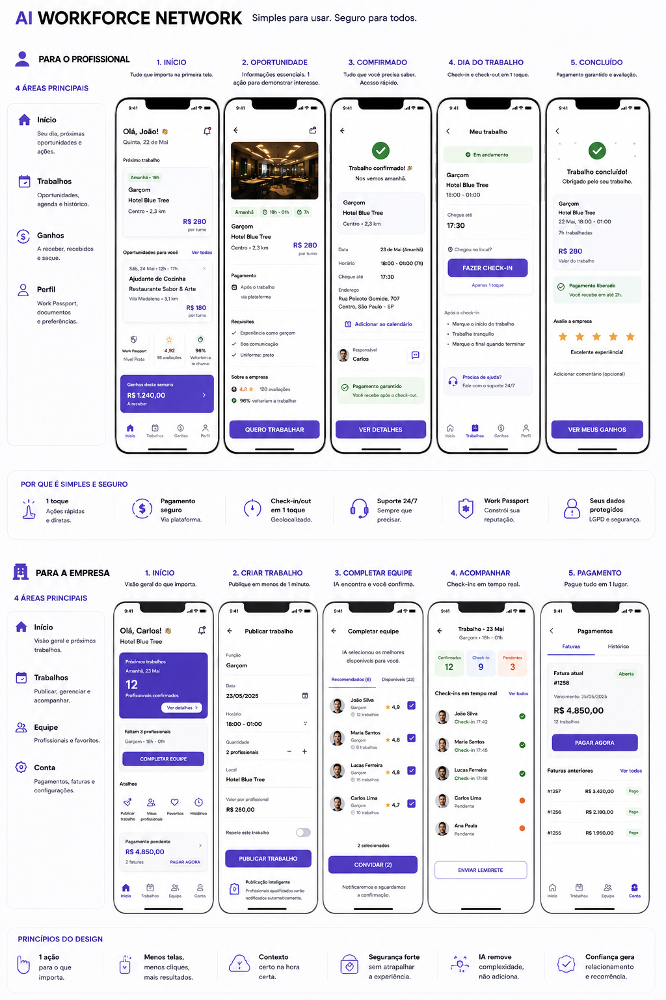

# Referência visual original — MLIVRETRABALHO

**Recuperada/verificada:** 09/10/2026. **Visual Truth Gate:** OPEN.

## Proveniência
- Fonte: AI_Workforce_Network_Documento_da_Verdade_v1.2.docx, criado em 20/09/2026.
- Item de origem: libfile_8219f29924d48191a09d7d3d3911a8c4 / file_00000000f308820ebc46bffdeffa2223.
- Seção 38, Figura 1: imagem página 26; descrição/navegação página 27.
- Arquivo dentro do DOCX: word/media/image1.png. Extração sem redimensionamento/edição.
- Dimensões: 1024×1536; PNG 1.542.425 bytes.
- SHA-256 DOCX: e1567107eae5b0dc4cd5bd99244e7c6cd4182716ae7203641e6cb57736797ef9.
- SHA-256 PNG: 7348ebe25461ca5919364652717a068489974c69398110401d6dabbfd7e30ccf.
- Git blob PNG: 60063d6fd7c70d83922f1485f4453986697a17a3.

## Escopo da referência
Profissional: Início, oportunidade, confirmado, dia do trabalho, concluído; barra Início/Trabalhos/Ganhos/Perfil. Empresa: Início, criar trabalho, completar equipe, acompanhar e pagamento; barra Início/Trabalhos/Equipe/Conta.

Preservar foco no essencial, hierarquia/cards, ação contextual, linguagem humana, simplicidade e barra canônica. A imagem não contém referência específica para todos os destinos, estados loading/erro/vazio ou telas adicionais; não inferir cobertura total dela.

## Diferença entre desenho e fato
João/Carlos/Hotel Blue Tree, 2,3 km, R$280/R$1.240/R$4.850, counts, scores/percentuais e calendário são ilustrações. “Pagamento garantido”, “você recebe em até 2h” e “suporte 24/7” exigem capacidade, gates e evidência real; não são autorizações para promessa financeira ou operação inexistente.

## Auditoria a executar
Comparar capturas do app real no SHA integrado, com API autenticada e fixtures explicitamente identificadas, às cinco situações de cada lado e às quatro áreas principais. Registrar fidelidade de estrutura/ação, dados corretos e loading/erro/vazio, acessibilidade, navegação e orçamento de fricção. CI/export/APK inicializam a base técnica; não demonstram todas essas jornadas.
